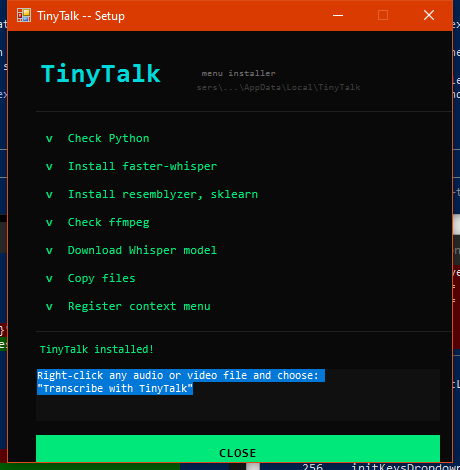
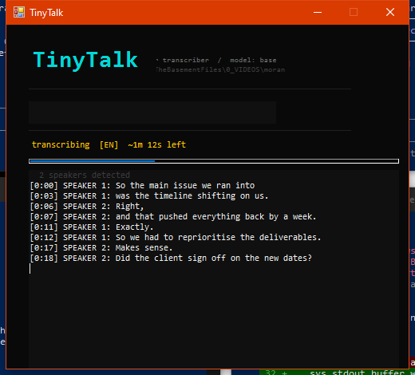
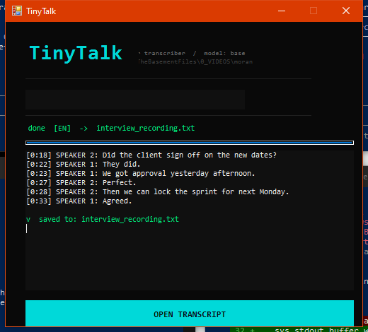

# TinyTalk Context Menu

**Right-click any audio or video file → instant local transcription with speaker detection**

TinyTalk adds a single right-click option to every audio and video file on Windows. It runs [OpenAI Whisper](https://github.com/SYSTRAN/faster-whisper) locally — nothing is uploaded, no API key, no cloud. The transcript lands as a `.txt` file right next to your source file, with per-sentence timestamps and automatic speaker labels.

---

## Screenshots

| Installer | Transcribing | Done |
|-----------|-------------|------|
|  |  |  |

---

## Install

Download **[TinyTalk_Setup.exe](../../releases/latest)** and run it.

The installer handles everything in one shot:

1. Locates Python on your system
2. Installs `faster-whisper`, `resemblyzer`, and `scikit-learn`
3. Checks for ffmpeg — installs via winget or downloads a static binary if missing
4. Downloads the Whisper model (~150 MB, cached locally, never re-downloaded)
5. Copies files to `%LOCALAPPDATA%\TinyTalk\`
6. Registers the context menu for 15 video and 10 audio formats, with icon

Re-running the installer skips everything already in place — only installs what's missing.

> **Requires Python 3.8+.** Download from [python.org](https://python.org) if not installed.

---

## Usage

1. Right-click any audio or video file
2. Click **Transcribe with TinyTalk** (teal speech-bubble icon)
3. Transcript streams live — per-sentence timestamps, speaker labels update in real time
4. ETA countdown shown while transcribing
5. Hit **Open Transcript** when done

The `.txt` file is saved in the same folder as your source file.

**Supported formats:** `.mp3` `.wav` `.m4a` `.flac` `.ogg` `.aac` `.wma` `.opus` `.aiff` `.mp4` `.mkv` `.mov` `.avi` `.wmv` `.webm` `.flv` `.ts` `.m2ts` `.mpg` `.3gp` and more

---

## Transcript format

```
[0:00] SPEAKER 1: So the main issue we ran into
[0:03] SPEAKER 1: was the timeline shifting on us.
[0:06] SPEAKER 2: Right,
[0:07] SPEAKER 2: and that pushed everything back by a week.
[0:11] SPEAKER 1: Exactly.
```

- **Timestamps** are per-sentence, derived from Whisper's word-level timing
- **Speaker labels** appear automatically when multiple voices are detected — no setup, no API keys
- Lines split on speaker changes mid-sentence as well as at punctuation boundaries
- Single-speaker files get clean timestamps with no labels

---

## Features

| Feature | Details |
|---------|---------|
| 100% local | No internet required after setup. Nothing leaves your machine. |
| Speaker detection | Automatic — detects and labels up to N speakers using voice embeddings |
| Per-sentence timestamps | Every clause timestamped at word level, not just every few seconds |
| Live ETA | Calculates remaining time based on measured processing speed |
| Video support | Transcribes audio track directly from any video container via ffmpeg |
| Background model updates | Checks for Whisper model updates silently; swaps after current transcription |
| Context menu icon | Teal speech-bubble icon appears inline in the right-click menu |
| Smart installer | Skips already-installed packages; registered per file extension not just type |

---

## Keeps itself updated

On every run, TinyTalk silently checks HuggingFace for a newer Whisper model. If one is available it downloads in the background while your file transcribes — using the current model the whole time. When done you'll see: `↑ model updated — will use next run`.

---

## Model sizes

Edit `MODEL_SIZE` at the top of `tinytalk.py` to trade speed for accuracy:

| Model | Download | Speed | Notes |
|-------|----------|-------|-------|
| `tiny` | 75 MB | fastest | fine for clear speech |
| `base` | 150 MB | fast | **default** |
| `small` | 500 MB | medium | noticeably better accuracy |
| `medium` | 1.5 GB | slow | good for accents / music |
| `large-v3` | 3 GB | slowest | best possible |

---

## Uninstall

Run `uninstall.bat` to remove the context menu entries, then delete `%LOCALAPPDATA%\TinyTalk\` to remove all files.

---

## Build from source

```
build.bat
```

Requires Python + PyInstaller (`pip install pyinstaller`). Outputs `dist/TinyTalk_Setup.exe`.

---

## Requirements

- Windows 10/11
- Python 3.8+
- All other dependencies installed automatically by the setup

---

## More tools like this

Built by [dvlce.ca](https://dvlce.ca) — see [webdev.dvlce.ca](https://webdev.dvlce.ca) for the full project showcase.

## License

MIT with [Commons Clause](https://commonsclause.com/) — free to use, modify, and share. Commercial resale not permitted.
